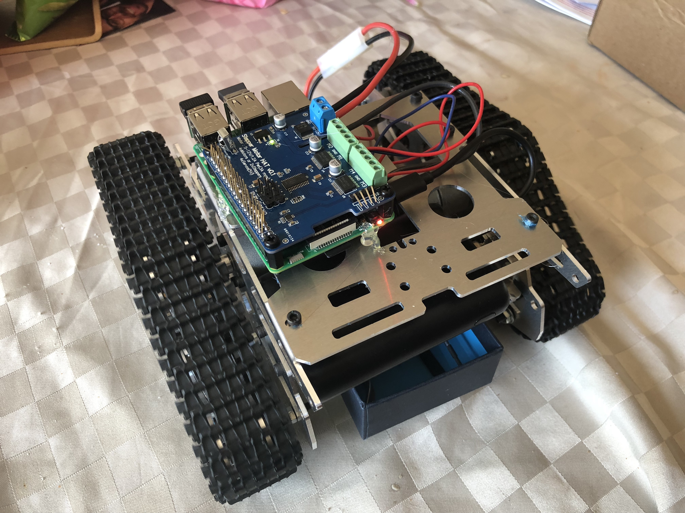

# raspberry-swift



Swift 3.1 app on the Raspberry Pi 3

[](https://asciinema.org/a/PXSoeFxyFvMVaBKC4M8BSSulF)

# Logging In & Building
This command will search the local network by MAC address and find ones that belong to Raspberry Pi devices.
`sudo arp-scan --localnet --interface=en0 | grep b8:27:eb:`

To log in, you will likely need to pass along the username, and (in my case) pass along the particular RSA key you have set up on the device.
`ssh steven@172.20.10.6 -i ~/.ssh/raspberry_rsa`

Then to build and run the app:
```
cd tank
swift build
sudo ./.build/debug/RaspberrySwift
```

# Installing Swift
```
cd /
wget https://github.com/shepting/raspberry-swift/blob/master/archives/swift-3.1.1-RPi23-1604.tgz
sudo tar -xvzf swift-3.1.1-RPi23-1604.tgz
sudo apt install clang
sudo apt install libpython3.5-dev
sudo apt install libcurl3
```

# Hardware Used
 - Rasberry PI 3 https://www.amazon.com/Raspberry-Model-1-2GHz-64-bit-quad-core/dp/B01CD5VC92
 - 32GB Micro-SD Card https://www.amazon.com/SanDisk-microSDHC-Standard-Packaging-SDSQUNC-032G-GN6MA/dp/B010Q57T02
 - Relay https://www.amazon.com/Tolako-Arduino-Indicator-Channel-Official/dp/B00VRUAHLE/
 - 3.5" Monitor https://www.amazon.com/Raspberry-Display-kuman-480x320-Interface/dp/B01CNJVG8K
 - Keyboard + Trackpad https://www.amazon.com/Rii-Stainless-Wireless-Rechargable-Raspberry/dp/B00ESUXXZM
 - Raspberry Pi Breadboard & Mount https://www.amazon.com/Transparent-Experiment-Breadboard-Raspberry-Rapsbery/dp/B0155XBBFO

# Talking Over I2C
Sample Python configuration and bit shifting: https://github.com/switchdoclabs/SDL_Pi_Grove4Ch16BitADC/blob/58e2a8e32b03d2c463bde59821d210b16a792ad1/Adafruit_ADS1x15/Adafruit_ADS1x15.py#L266-L268

# Resources
 - Umberto Raimondi (uraimo) "SwiftyGPIO" https://github.com/uraimo/SwiftyGPIO
 - Ray Fix "Unsafe Swift" https://www.raywenderlich.com/148569/unsafe-swift
 - Marius Rackwitz "Swift HomeKit Accessories" https://speakerdeck.com/marius/diy-smarthome-build-your-own-homekit-accessories
 - Nate Cook "Swift's Pointy Bits: Unsafe Swift and Pointer Types" https://academy.realm.io/posts/nate-cook-tryswift-tokyo-unsafe-swift-and-pointer-types/
 - UnsafeMutablePointer https://developer.apple.com/documentation/swift/unsafemutablepointer
 
